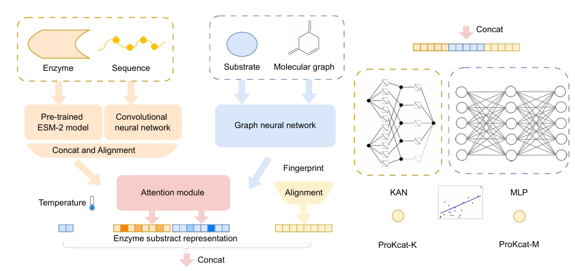

# ProKcat
Multimodal Regression for Enzyme Turnover Rates Prediction
This paper has been published in [[IJCAI 2025]](https://2025.ijcai.org/). This is the code.



## Data
BRENDA Release 2025.1 is now online.
This new release includes:
168 new EC Classes and 1620 updated EC Classes
6,857 new primary literature references
An updated metabolic pathway map featuring five new pathways: Glutathione-mediated detoxification, Curcuminoid biosynthesis, Monoterpenoid biosynthesis, Tropane alkaloid biosynthesis, Secologanin biosynthesis.
Suggesting download the updated data in JSON and TXT formats [[here]](https://www.brenda-enzymes.org/download.php). 

## File Specification 
1. Data preparation: GetData.ipynb.from [[DLTKcat]](https://github.com/SizheQiu/DLTKcat).
2. Get SMILES strings and enzyme protein sequences features using code/gen_features.py, which will generate features using code/feature_functions.py.
3. run_esm_Kcat_finetune.ipynb and run_esm_Kcat_finetune.py is used to train and finetune esm. It may not be a good choice.
4. run_esm_Kcat.ipynb using protein esm embeddings and compound features, etc to predict Kcat.
5. run_train_test.ipynb, run KAN experiments on finetuned models.
6. Models in run_train_test.ipynb and run_esm_Kcat.ipynb can be merged to predict Kcat.

The KAN models or AI models' interpretability for science still have a long way to go.

## Main Dependency
Pytorch (1.8.1+cu101)

Scikit-learn

esm

RDKit

BRENDApyrser

KAN


## Thanks
Thanks for the work [[DLTKcat]](https://github.com/SizheQiu/DLTKcat). The data and baseline models are mainly obtained from this repository.

## Citation
If you find this project useful for your research, please use the following BibTeX entry.

```
@inproceedings{hu2025Multimodal,
  title={Multimodal Regression for Enzyme Turnover Rates Prediction.},
  author={Hu, Bozhen and Tan, Cheng and Li, Siyuan and Zheng, Jiangbin and Xia, Jun and Li, Stan Z.},
  booktitle={Thirty-fourth International Joint Conference on Artificial Intelligence (IJCAI 2025)},
  year={2025},
  organization={International Joint Conferences on Artificial Intelligence Organization}
}
@article{qiu2024dltkcat,
  title={DLTKcat: deep learning-based prediction of temperature-dependent enzyme turnover rates},
  author={Qiu, Sizhe and Zhao, Simiao and Yang, Aidong},
  journal={Briefings in Bioinformatics},
  volume={25},
  number={1},
  pages={bbad506},
  year={2024},
  publisher={Oxford University Press}
}
```

